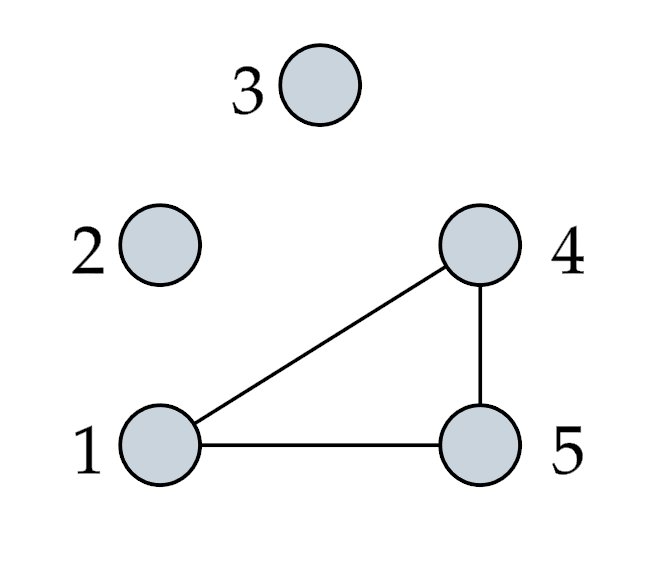

# Counting Homomorphisms in Rust

This repository contains an implementation of the dynamic programm of 
[Diaz, Serna and Thilikos](https://www.sciencedirect.com/science/article/pii/S0304397502000178)
for computing the number of homomorphisms between two graphs and a modified version of it. The implementation is written in Rust and additionally contains a 
file handler for the file format explained in the next sections and some running time experiments.

## input Format for graphs

Here is an example of the graph format, which is a simplification of 
the [METIS](http://glaros.dtc.umn.edu/gkhome/metis/metis/overview) format.

```
% A graph with 5 vertices and 3 edges
5 3
%  Here begins the list of neighbours of each vertex
4 5
    
    
% The following line expresses the neighbours (1 and 5) 
% of vertex 4 
1 5
1 4
```

The example represents the following graph.



Consisting of the following parts:
1) Command lines begin with `%`
2) The fist non-command line states the number of vertices and then the number of edges.
3) The following lines describe the adjacency of the graph. 
The i-th non-command line reports the neighbours of the i-th vertex

## Input Format for NTD

Here is an example for the input format of nice tree decompositions ending with `.ntd` extension. 
Format has been inspired by [this format for tree decompositions](https://github.com/PACE-challenge/Treewidth#output-format)

```
s 10 2 4
n 1 l 1
n 2 i 1 2
n 3 f 2
n 4 l 2
n 5 i 2 3
n 6 f 2
n 7 j 2
n 8 i 2 4
n 9 f 4
n 10 f
a 2 1
a 3 2
a 7 3
a 5 4
a 6 5
a 7 6
a 8 7
a 9 8
a 10 9
```

The example represents the following nice tree decomposition.


Consisting of three parts:
1. with `s` at the beginning: This line describes the main parameter of 
this nice tree decomposition : number of nodes, width + 1 & number of 
vertices of the original graph.
2. wit `n` at the beginning: These line describe the nodes. The first argument
stands for the ID of the node, the second argument describes the sort of node:
   1. `l` : Leaf Node
   2. `i` : Introduce Node
   3. `f` : Forget Node
   4. `j` : Join Node
3. with `a` at the beginning: Describe adjacency of the tree nodes. For example
`a 7 3` means there is an edge from node `7` to node `3` i. e. that node `3` is the 
child of node `7`.


Note that the indices in the file go from 1 to N while the internal representation consists of indices 0 to N-1.

## How to run the Experiments

1. clone the complete repository. Test data is already included.
2. Run the command `cargo test` in the main project folder to run unit tests.
3. Run the command `cargo run --release` in the main project folder to start tests.
4. finish
5. To visualize the results use the `evaluation.ipynb` file, which can 
be executed with jupyter-lab and immediately shows the results. Make sure, you have installed
the `seaborn` python package to run the code.